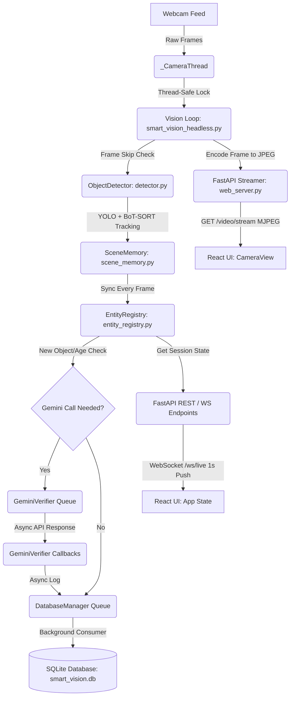

# Smart Vision Assistant: Comprehensive Study Guide (Full Architecture Edition)

Welcome to the ultimate learning guide for the **Smart Vision Assistant**. This document acts as your comprehensive computer vision, software architecture, and real-time systems teacher. We will walk through the system step-by-step, explaining the technology stack, the multi-threaded data flow, the database schema, and the persistent session memory engine.

---

## 1. The Big Picture: System Architecture & Data Flow

To support smooth 15–30 FPS real-time computer vision while serving a modern web interface, the project is split into a **Headless AI Pipeline** running on a background thread and a **FastAPI Web Server** communicating with a **React Frontend**.

### 1.1 Architectural Blueprint


### 1.2 Tech Stack

*   **Backend (Python & C++ bindings):**
    *   **FastAPI:** Web framework exposing REST APIs and WebSockets.
    *   **OpenCV (cv2):** Camera capture, image resizing, annotated bounding box drawing, and high-performance JPEG encoding.
    *   **Ultralytics YOLO11m:** Deep-learning-based object detector running locally on CPU.
    *   **BoT-SORT:** Motion and appearance-based object tracker.
    *   **SQLite (sqlite3):** Local relational database optimized in Write-Ahead Logging (WAL) mode.
    *   **Google GenAI SDK (Gemini 2.0 Flash Lite):** Multimodal AI for semantic label verification and 3-bullet description generation.
    *   **psutil:** System-level telemetry (CPU, RAM).
*   **Frontend (HTML5, TailwindCSS, JavaScript/React):**
    *   **React (Vite-scaffolded):** Interactive SPA (Single Page Application) frontend.
    *   **TailwindCSS:** Modern styling using custom CSS utility tokens matching a high-fidelity dark theme.
    *   **Native WebSocket:** Auto-reconnecting, event-driven communication channel.

---

## 2. Core Features & Custom Enhancements

### 2.1 The Entity Registry Layer (Persistent Object Identity)
Traditional tracking models rely on trackers (like BoT-SORT) that issue simple numeric IDs (e.g., `track_id: 3`). If an object is obscured or leaves the frame, the tracker loses it; when it returns, it is stamped with a brand-new ID.

To solve this, the **Entity Registry** (`entity_registry.py`) introduces a stable, session-wide identity wrapper:
1.  **Stable UUIDs:** Every newly detected object gets a permanent UUID (`entity_id`).
2.  **Relinking Logic:** When an object disappears and returns, the registry performs semantic relinking. If a similar class (e.g., `Person`) disappears and reappears nearby within 30 seconds, the registry maps the new YOLO tracker ID back to the existing UUID.
3.  **Accumulated History:** The registry stores a historical ring buffer of bounding boxes, events, relationships, and Gemini descriptions per entity.

### 2.2 Session Memory (ACTIVE vs. INACTIVE States)
By default, computer vision apps only display objects currently visible. When an object leaves the frame, it vanishes from the UI, resulting in a loss of historical context.

The **Session Memory Engine** changes this behavior:
*   **Confidence Gate:** Any object detected with **confidence >= 80%** and visible for **>= 2 seconds** is written to session memory.
*   **ACTIVE State:** The object is currently visible in the camera view.
*   **INACTIVE State:** The object has left the camera view. Instead of being deleted, it is marked as `INACTIVE`.
*   **Last Seen Telemetry:** Inactive objects show `LAST SEEN Xm Ys AGO` in reports and cards, while preserving their last known bounding box, highest confidence score, accumulated active duration, events list, and relationships.
*   **Append-Only & Lightweight:** Inactive objects are stored in memory and updated in the database. Crucially, they are never re-sent to Gemini or re-evaluated by the relationship engine, protecting CPU cycles.

---

## 3. Data Flow & Communication Channels

The system uses two dedicated channels to feed data to the web browser:

### 3.1 Live Camera Feed (MJPEG Streaming)
Sending 30 FPS video frames over WebSockets incurs high CPU overhead for encoding/decoding and bloats memory. Instead, the application uses **MJPEG (Motion JPEG)**:
1.  In `smart_vision_headless.py`, the annotated camera frame is encoded to JPEG bytes using `cv2.imencode`.
2.  `web_server.py` exposes `GET /video/stream`, which runs an async generator yielding multipart frames with content boundary blocks:
    ```http
    Content-Type: multipart/x-mixed-replace; boundary=frame

    --frame
    Content-Type: image/jpeg

    [RAW JPEG BYTES]
    --frame
    Content-Type: image/jpeg
    ...
    ```
3.  The React `<CameraView>` displays this feed using a standard HTML image tag:
    ```html
    
    ```
    The browser decodes and displays this stream natively on its own render thread.

### 3.2 Structured JSON Reports (WebSockets)
Structured data is sent directly over WebSockets in a JSON payload to let the React client build high-fidelity cards and timelines. Every second, the FastAPI WebSocket `/ws/live` pushes:

*   **objects:** Active, filtered objects (conf >= 80%, age >= 2s).
*   **inactive_objects:** Inactive, historical objects observed since startup.
*   **relationships:** Inter-object proximity status with count metrics.
*   **status:** CPU, RAM, and Vision Pipeline FPS logs.
*   **report:** Session-wide metrics and stability ratios.

---

## 4. File-by-File Masterclass

Let's dissect the core files that make up the complete backend pipeline, intelligent engines, and web UI:

### File 1: `entity_registry.py` — Stable Identity Engine
*   **Purpose:** Maintains stable UUID-based identities (`Entity`) for all detected objects. Adopts objects into session memory via a >= 80% confidence threshold, manages their ACTIVE/INACTIVE transitions, and constructs structured reports.
*   **Key Logic Block:**
    ```python
    if rec.confidence >= 0.80:
        eid = self._track_to_entity.get(tid)
        if not eid:
            # Relink check or register new
            entity = self._find_relinkable(rec.display_label, rec.category)
            if not entity:
                entity = Entity(entity_id=str(uuid.uuid4()), ...)
            self._session[entity.entity_id] = entity
            self._track_to_entity[tid] = entity.entity_id
    ```

### File 2: `smart_vision_headless.py` — Vision Loop Wrapper
*   **Purpose:** Orchestrates camera capture, YOLO detection, scene memory, event triggers, relationship mapping, and Gemini calls in a background thread. It runs without graphical UI windows (`cv2.imshow`) or keyboard blocking.
*   **Key Logic Block:**
    It updates the `EntityRegistry` and stores the resulting structured report along with raw JPEG frames inside a thread-locked shared memory cache:
    ```python
    with self._state_lock:
        self._latest_jpeg = jpeg_bytes
        self._cached_state = { ... }
    ```

### File 3: `web_server.py` — Web API & WebSocket Hub
*   **Purpose:** The web gateway. It initializes `SmartVisionHeadless` inside FastAPI's startup context manager, exposes endpoints for system health, current objects, and the MJPEG stream, and manages WebSocket channels.
*   **Key Logic Block:**
    The WebSocket server pulls the thread-safe state cache every second and pushes it to active web clients:
    ```python
    @app.websocket("/ws/live")
    async def websocket_live(ws: WebSocket):
        await ws.accept()
        while True:
            state = _vision.get_state()
            await ws.send_json(state)
            await asyncio.sleep(1.0)
    ```

### File 4: `frontend/src/hooks/useWebSocket.js` — Client Connection
*   **Purpose:** React hook that establishes a native WebSocket connection to `/ws/live` and handles connections with an exponential back-off reconnection timer.

### File 5: `frontend/src/components/ObjectCards.jsx` — Visual Cards
*   **Purpose:** Separates objects into two grid layouts: **Active Objects** (in-view, highlighted in color, green pulse indicator) and **Previously Observed** (out-of-view, dimmed, orange clock indicator displaying `last seen X ago`).

### File 6: `frontend/src/components/SceneReport.jsx` — Report Renderer
*   **Purpose:** Renders the natural language scene summary, lists cumulative relationship statistics, and shows detailed expansion cards containing the full event timelines and Gemini analysis for active and inactive entities.

### File 7: `database_manager.py` — SQLite Persistence Layer
*   **Purpose:** Asynchronous producer/consumer database manager with a dedicated background writer thread. It logs sessions, reports, active objects, and lifecycle events to `smart_vision.db` without blocking the main vision loop.

### File 8: `ocr_engine.py` & `product_knowledge.py` — Text & Brand Recognition
*   **Purpose:** `ocr_engine.py` runs local text extraction (PaddleOCR/EasyOCR) on cropped object images. `product_knowledge.py` acts as a local Knowledge Base mapping extracted text (e.g., "bisleri") to product types ("Water Bottle").

### File 9: `spatial_engine.py` & `relationship_engine.py` — Geometric Intelligence
*   **Purpose:** Evaluates geometric relationships (e.g., `near`, `inside`, `on_top_of`) using pure math on bounding boxes, eliminating the CPU overhead of ML-based scene graph generation.

### File 10: `event_engine.py` — Behavioral Rules Engine
*   **Purpose:** Monitors object state over time to emit high-level behavioral events, determining when an object becomes `Stationary`, is `Moved`, or is `Abandoned`.

### File 11: `search_engine.py` & `query_interpreter.py` — Visual Memory Search
*   **Purpose:** Allows querying historical visual memory. The interpreter translates natural language queries into structured SQLite filters using NLP heuristics (no LLM required).

### File 12: `report_engine.py` & `timeline_engine.py` — Analytics & Histories
*   **Purpose:** `report_engine.py` formats structured scene reports for console logging, while `timeline_engine.py` reconstructs chronological event histories and object lifecycles from the database.

---

## 5. Key Concurrency & Optimization Patterns

### A. Non-Blocking IO (Vignette Isolation)
Under heavy CPU load (YOLO run + camera decode), blocking operations can degrade the camera capture frame rate.
*   **Headless Separation:** By dividing the FastAPI HTTP/WS routing process and the camera capture loop onto separate OS-level threads, network IO and browser rendering never interfere with frame rates.

### B. Dual-Filtering Security
To prevent low-confidence noise from polluting database history and the frontend UI, filtering is implemented on multiple layers:
1.  **Registry admission:** `EntityRegistry` drops all tracks below 80% confidence.
2.  **API transmission:** Endpoints strip any entities that do not meet the duration requirements (>= 2s).
3.  **UI safeguards:** React memoized selectors (`useMemo`) filter arrays on the client side before rendering cards.

---

## 6. How to Run the Web Application

We use a batch script to automate environment setup, package installations, and server startups.

1.  **Launch the System:**
    Double-click the script in the project root:
    ```
    start_web.bat
    ```
    *   This script will verify your Python environment and run `pip install -r requirements.txt`.
    *   It will run `npm install` inside the `frontend/` directory to configure Vite.
    *   It opens two separate CMD windows: one starting FastAPI (`uvicorn web_server:app`) on port 8000, and one starting the Vite development server on port 5173.
2.  **View the Dashboard:**
    Open your browser and navigate to:
    ```
    http://localhost:5173
    ```

---

## 7. Study Guide Q&A (Session Memory Edition)

1.  **Why do inactive objects show zero CPU utilization on the backend?**
    *   *Answer:* Once an object transitions to `INACTIVE` (leaves the camera frame), it is no longer processed by YOLO, the event engine, or the relationship parser. Its state is frozen in the `EntityRegistry` memory, meaning it uses zero CPU cycles.
2.  **What is the benefit of using an MJPEG stream over sending video frames via WebSockets?**
    *   *Answer:* WebSockets require converting frames to Base64 strings, which increases data size by ~33% and places encoding/decoding overhead on both the Python server and the React UI. MJPEG uses native browser image decoding, leaving the WebSocket free to transmit lightweight JSON telemetry.
3.  **How does the system prevent duplicate entities from registering when tracking is briefly lost?**
    *   *Answer:* `EntityRegistry` runs a relinking mechanism (`_find_relinkable`). If an object disappears and reappear within 30 seconds with matching characteristics (label and category), the registry maps the new track back to the original entity instead of creating a new UUID.
4.  **If the camera is muted, does the session memory reset?**
    *   *Answer:* No. The session memory survives as long as the backend server thread is alive. Mutings, connection drops, or refreshing the browser page will not clear the accumulated memory of the room.
