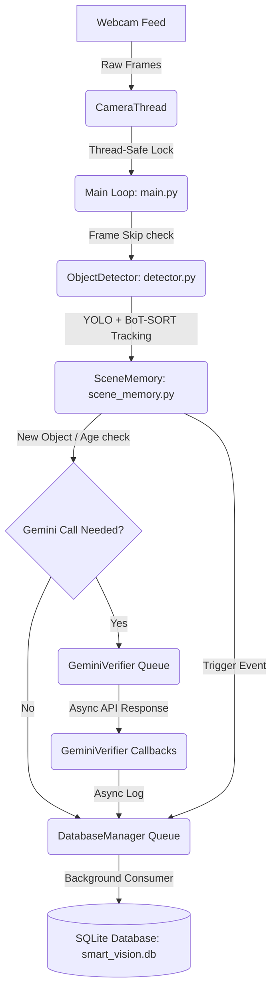

# Smart Vision Assistant: Comprehensive Educator's Study Guide

Welcome to the ultimate learning guide for the **Smart Vision Assistant**. Think of this document as your personal computer vision and software architecture teacher. We will walk through this project step-by-step, breaking down every file, every database schema detail, and every advanced concurrency design pattern. 

By the end of this guide, you will understand not just *what* the code does, but *why* it was designed this way and *how* all the moving parts synchronize in real-time.

---

## 1. High-Level Blueprint: How Data Flows

Before we look at the code, let's understand the life of a single camera frame and how it translates into long-term visual memory.

### The Pipeline Architecture


### The Three Concurrency Pillars
To keep the webcam running smoothly at 15–30 FPS on a standard CPU, the system divides work across three independent execution lanes:
1. **The Main Thread (Webcam, Detection & UI):** Grabs frames, runs YOLO, draws bounding boxes, and handles keyboard inputs.
2. **The Database Thread (`DatabaseManager`):** Performs all disk writes and schema management.
3. **The Gemini Thread (`GeminiVerifier`):** Executes network calls to refine labels and compile bullet-point summaries.

---

## 2. File-by-File Masterclass

Let's dissect each file in the codebase. We will explain its core purpose, key logic blocks, and educational takeaways.

---

### File 1: `config.py` — The Control Room
* **Purpose:** The single source of truth for global constants, camera specifications, detection thresholds, database configurations, and Gemini API rate limits.
* **Key Components:**
  * `CAMERA_INDEX`: Specifies which webcam to capture.
  * `OBJECT_STALE_TIMEOUT`: The duration (seconds) an object can be missing from the camera's view before the system officially declares it "removed."
  * `GEMINI_SESSION_BUDGET`: A protective budget cap limiting how many times the system can call the Gemini API during a single execution. This prevents runaway API costs.
* **Teacher's Explanation:** 
  > *"Think of `config.py` as the knobs and dials on a machine. Instead of hunting through thousands of lines of code to change how long the system remembers an object, you adjust one number here. It keeps the rest of the code clean, modular, and easy to maintain."*

---

### File 2: `main.py` — The Conductor
* **Purpose:** The application entry point. It manages the webcam loop, controls timing, displays the graphical window, and coordinates the detector, database, and verifier.
* **Key Components:**
  * **`CameraThread`:** Captures raw images from the hardware in a background loop.
    ```python
    def read(self) -> tuple:
        with self._lock:
            if self._frame is None:
                return False, None
            return self._ret, self._frame.copy()
    ```
    *Why copy?* If we don't copy, the main thread and camera thread might try to read/write the same array memory at the same time, leading to corrupted, torn images.
  * **Adaptive Frame Skipping:** Monitors execution duration. If YOLO inference slows down the loop, the engine selectively skips detector frames to ensure the display frame rate doesn't freeze.
  * **Graceful Cleanup:** Catches interrupts (`Ctrl+C` or pressing `Q`) to guarantee background queues are drained and the database commits cleanly before exiting.
* **Teacher's Explanation:**
  > *"The main loop is like a heartbeat. On every beat (or tick), it reads a frame, detects objects, checks if it's time to print a report, renders the screen, and waits. If the computer gets slow, the heart keeps beating smoothly by skipping heavy detection computations on some frames."*

---

### File 3: `detector.py` — The Vision System
* **Purpose:** Initializes the YOLO11 model, runs object detection, tracks objects across frames, and renders bounding boxes on the video feed.
* **Key Components:**
  * **YOLO11 Integration:** Loads model weights (`yolo11m.pt` or `yolo11n.pt`) and performs CPU-based inference.
  * **BoT-SORT Tracker:** An algorithm that assigns a persistent ID (e.g., Track #3) to an object. It associates bounding boxes across frames so the system knows that "Object A" in Frame 1 is the exact same "Object A" in Frame 100.
  * **Targeted Cropping:** When an object becomes stable, the detector extracts the bounding box region (`crop_image`) and converts it to a PIL image to pass to the Gemini verifier.
* **Teacher's Explanation:**
  > *"YOLO is incredibly fast at finding rectangles, but it is 'stateless'—it doesn't know that the cup it saw a millisecond ago is the same cup it sees now. The Tracker acts like a sticky label, stamping 'ID #5' on the cup. We use that ID to map long-term events in the database."*

---

### File 4: `scene_memory.py` — The Short-Term Registry
* **Purpose:** Keeps track of what is *currently* visible, maps raw COCO categories to human-friendly categories, and evaluates scene stability.
* **Key Components:**
  * **`ObjectRecord`:** A Python data class storing individual object properties (track ID, raw label, Gemini-refined label, duration in scene, and bounding box coordinates).
  * **Category Mapping (`CATEGORY_MAP`):** Translates 80 standard YOLO classes into 10 structured categories (e.g., both "car" and "bus" become "Vehicles").
  * **Stability Window:** Tracks how frequently the set of active IDs changes. If the same group of objects remains in view, stability rises toward 100%.
* **Teacher's Explanation:**
  > *"SceneMemory acts like your short-term memory. It remembers what objects are in front of you right now. If an object disappears behind a hand for a fraction of a second, the grace period prevents the system from immediately forgetting it."*

---

### File 5: `database_manager.py` — The Long-Term Memory
* **Purpose:** Manages the relational database (`data/smart_vision.db`), initializes table schemas, and serializes visual memory tasks.
* **The 5-Table Schema Breakdown:**
  * **`sessions`:** Tracks system uptime.
  * **`reports`:** Tracks overall scene statistics at specific time intervals.
  * **`report_objects`:** Links specific objects and coordinates to reports (answering *"Where was the cup in report #2?"*).
  * **`object_events`:** A ledger logging exact lifecycle timestamps for `'new'`, `'removed'`, `'verified'`, and `'description_updated'` operations.
  * **`tracked_objects`:** Stores consolidated stats per unique object (average confidence, accumulated duration, and latest descriptions).
* **The Queue and Handshake Protocol:**
  ```python
  def _submit_sync(self, op: str, args: Any) -> Any:
      evt = threading.Event()
      result_box = [None, None]
      self._write_queue.put((op, args, evt, result_box))
      evt.wait()  # Wait here until background thread calls evt.set()
      return result_box[0]
  ```
* **Teacher's Explanation:**
  > *"SQLite is synchronous and can lock the application if written to from multiple threads. To solve this, `DatabaseManager` runs a single 'writer thread.' It is like a banker sitting in a secure office. The main loop slips deposit slips (write operations) under the door. If it needs a receipt (like a session ID), it waits for a handshake; otherwise, it walks away immediately."*

---

### File 6: `gemini_verifier.py` — The Brain
* **Purpose:** Connects to the Gemini Flash API to refine general YOLO labels and create detailed 3-bullet descriptors.
* **Key Components:**
  * **Rate Limiting:** Enforces a cool-down period between requests to stay within rate-limit constraints.
  * **Response Verification:** Evaluates API responses. If Gemini returns vague phrases (like *"something"* or *"unidentifiable object"*), the verifier rejects the response and keeps the YOLO label.
  * **Callbacks:** Writes updates directly to the database via `on_object_verified` and `on_description_updated` events.
* **Teacher's Explanation:**
  > *"YOLO is fast but lacks context—it might label a toy dog and a real dog both as 'dog'. Gemini is smart but slow. We use YOLO to detect the object instantly, and then quietly send a cropped image to Gemini in the background to refine 'dog' to 'ceramic pug ornament' without freezing the screen."*

---

### File 7: `report_engine.py` — The Communicator
* **Purpose:** Formats session data and active objects into a clean, structured ASCII report printed to the terminal and logged to a file.
* **Key Components:**
  * **ASCII Layout Manager:** Dynamically pads strings, constructs boxes, and wraps text to guarantee reports are perfectly aligned regardless of terminal width.
  * **System Telemetry:** Uses `psutil` to track CPU, RAM, and FPS metrics and binds them to the database.
* **Teacher's Explanation:**
  > *"This is the presenter. It gathers short-term statistics from SceneMemory, hardware metrics from the operating system, and pushes them directly to the console and DatabaseManager, creating a permanent chronological audit log."*

---

## 3. Important Design Patterns Explained Simply

### A. The Producer-Consumer Pattern
In this pattern, one part of the program creates data (the producer) and another part processes it (the consumer). They communicate through a shared, synchronized queue.

* **In our project:** 
  - *Producer:* The detection loop in `main.py` detects an object or generates a report.
  - *Queue:* `_write_queue` in `DatabaseManager`.
  - *Consumer:* `_writer_loop` running in the background thread.
* **Why it matters:** It decouples the slow, unpredictable disk storage layer from the high-speed camera frame rate.

### B. Thread-Safety with Locks (Mutexes)
When multiple threads access the same variable or system resources, they can corrupt data (known as a **race condition**). 

* **In our project:** The camera thread and main thread both access `_frame`. We protect it using:
  ```python
  with self._lock:
      self._frame = frame
  ```
  While the camera thread is writing a new frame, the lock is acquired. If the main thread tries to read, it must wait until the write completes, preventing broken image arrays.

### C. Write-Ahead Logging (WAL) in SQLite
Standard SQLite locking locks the entire file during writes, preventing reads. 
* **WAL Mode:** We execute `PRAGMA journal_mode = WAL;`.
* **Why it matters:** WAL allows multiple threads to read the database at the same time a background thread is writing to it. This is essential for the `DatabaseManager` to run smoothly.

---

## 4. Study Guide Q&A

1. **Why does the `CameraThread` return a copy of the frame (`self._frame.copy()`) instead of the original reference?**
   * *Answer:* To prevent the main thread from reading frame pixels at the same millisecond the camera background thread is updating them, which causes memory corruption.
2. **What is the difference between `_submit_sync` and `_submit_async` in `database_manager.py`?**
   * *Answer:* `_submit_sync` blocks the calling thread using a `threading.Event` until the database records the item and returns a row ID. `_submit_async` pushes the item to the queue and returns control immediately.
3. **How does `OBJECT_STALE_TIMEOUT` in `config.py` protect the database from being flooded with deletion events?**
   * *Answer:* If a tracked object disappears briefly (due to noise or occlusion), the system waits for the timeout before committing the `'removed'` event, keeping logs clean.
